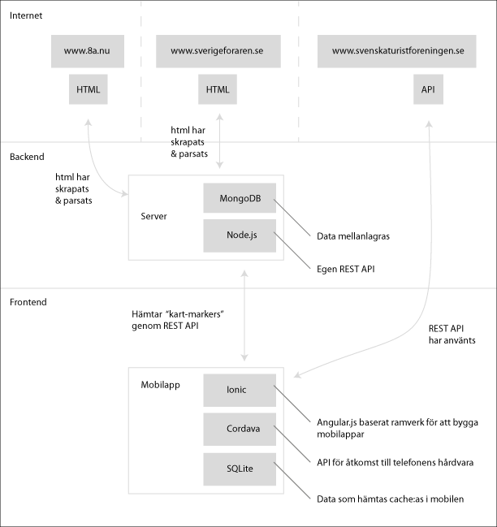

# 1dv449-Project
A mashup application for the course 1dv449 on Linnaeus University

## The Mashup, initial vision

Appnaamn: Climspotter

### Inledning

Tekniker som använs:

- Frontend: (Javascript) Angular.js, Ionic, Cordava, SQLite, Google Maps API
- Backend: (Javascript) MongoDB, Node.js

[Demonstrationsfilm för Appen](https://www.youtube.com/watch?v=Nu6H7tAVJ)

Anledningen till att appen blev av är att jag personligen i flera år har tyckt att det saknas en bra överblick och sammanställning av all klättring som finns i trakterna omkring. Klättersidorna som finns på nätet är få och innehåller till största del olika klättringsinformation. Som klättrare så måste man ha koll på alla dessa och gå in på varje enskild för att ta reda på om det kan finns någon klättring av intresse i närheten.

Idag så finns det inga liknande applikationer vad jag vet, men jag kan ha fel. Klättersidorna har dock delvis börjar komma ut med sina egna mer avancerade applikationer. Men ingen har syftet att fungera som en "sökmotor"  för all klättring som denna app har som syfte att göra.

Inledning där du kort beskriver vad du gjort och bakgrunden till din applikation. Finns det liknande applikationer redan? Vilka tekniker har använts.

### Schematisk bild

Inkludera en schematisk bild över applikationens beståndsdelar så att läsaren har enklare att förstå applikationens dataflöde.

Säkerhet och prestandaoptimering - Hur har du funderat kring säkerhet och prestanda och vilken teori har du kopplat detta emot.
Offline-first: Hur har du tänkt kring offline-first?
Risker med din applikation: Reflektera över vilka risker det finns med din applikation; rent tekniskt, säkerhet, etiskt m.m.
Egen reflektion kring projektet: Här tar du upp hur projektet har gått. Vilka eventuella problem har du stött på? Finns det funktioner som du velat implementera men inte hunnit? Hur skulle du vilja jobba vidare med din applikation?
Skriv också om de eventuella delar du anser vara betygshöjande med din applikation. Motivera varför du anser dessa vara betygshöjande.

I have two potential paths to follow. Focusing on both will be too time-consuming.

## Potential App functionality 

### App angle 1: Tools for climbing trips (This is the main focus for now)

#### Tools:
- Nearest gas stations from eniro (API) (Swedish only)
- Nearest accomodations from STR (API) (Swedish only)
- Nearest bathing sites from eniro (API) (Swedish only)
- Climbing Locations from climbing.iloove.it (scraped)
- Pictures of locations from climbing.iloove.it (scraped)
- Climbing Locations from thecrag.com (API)
- Weather info for location from yr.no (API)
- Google maps for map (API)

### App angle 2: News and inspiration (Maybe will be implemented partially)

#### News:
- News text from http://www.climbing.com/feed/ (rss)
- News text from http://www.rockandice.com/RSSRetrieve.aspx?ID=13126&Type=RSS20 (rss)

#### Inspiration: 
- Movies from Vimeo (API)
- TV from Youtube - Climbing daily (API)
- Pictures from climbing.iloove.it (scraped)
- Climbing Locations from climbing.iloove.it (scraped)

### Other potential sources:

	Twitter, instagram, google street view, 
	
## Memos

Working order:   
    
1. Setup/build a climbing GeoJSON search engine
  1.1 Install couchDB with GeoCouch
  1.2 Build scrapers for different climbing sites (which approves this) that scrapes markers and stores GeoJSON objects with href links to the sites for more information about the GeoJSON marker. This gives the climbing sites more potential users.

2. Setup project enviroment

#### 1.1 CouchDB with GeoCouch extension/plugin

1. Install and run the following docker container https://hub.docker.com/r/elecnix/geocouch/

#### 2. Setup project enviroment
- GitHub client
- Node.js
- Java SDK
- Android SDK
- Install Cordova (API that gives the App access to Android hardware)
- Apache Ant
- Genymotion (Android)
- Ionic (Angular Mobile App Framework)
